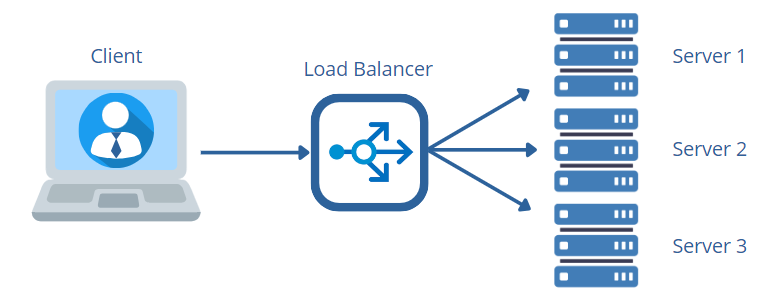

  

  <h1>Sistema di Bilanciamento del Carico per Server</h1>

     
***
Questo repository contiene un'implementazione in Python di un sistema client-server intermediato da un sistema di load balacing. Il load balancer sfrutta l'algoritmo di bilanciamento del carico Weighted Round Robin, che assegna in maniera sequenziale le richieste ai server ad esso collegati che risultano attivi e non in sovraccarico.

## Introduzione
Questo programma implementa un sistema di File Transfer Protocol (FTP) client-server intermediato da un server di load balacing utilizzando Python. Per fare ciò utilizza tre classi: Client, LoadBalancer e Server. Il client effettua delle richieste di invio file al load balancer, il quale li invia ai server sfruttando l'algoritmo di bilanciamento del carico Weighted Round Robin. Questo algoritmo assegna le richieste in maniera sequenziale ai server ad esso collegati e che risultano attivi e non in sovraccarico nella sessione. Ogni server riceve i file dal loadbalancer e li salva in una directory. 

## Descrizione dell'Architettura
L'architettura prevede l'utilizzo di un client, un load balancer e tre server FTP (File Transfer Protocol). Il `client` richiede in input un comando da eseguire; se viene digitato il comando "FTP", e viene successivamente inserito il numero di file, questi vengono scelti randomicamente tra i file contenuti nella cartella `file` e inviati al load balancer. Il `loadbalancer` riceve file JSON, li inserisce in una coda e li invia ai server che risultano essere disponibili alla ricezione; per verificare la disponibilità dei server, effettua costantemente un monitoraggio di connessione e di carico dei server ad esso collegati. Le richieste vengono assegnate utilizzando l'algoritmo di bilanciamento del carico Weighted Round Robin: il load balancer invia richieste ai server in maniera sequenziale. I `server` attivi che non sono in sovraccarico, ricevono i file dal loadbalancer e li salvano all'interno delle rispettive directory `json_files_1`, `json_files_2` e `json_files_3`.

Il sistema permette quindi una gestione dinamica dei server: il load balancer controlla i server attivi e inattivi in ogni sessione, per inviare le richieste solo a quelli connessi e disponibili. 
Con la stessa logica, il sistema appare altamente tollerante ai guasti, in quanto la disconnessione improvvisa di un server non causa interruzioni nell'invio delle richieste a quelli funzionanti.  

Inoltre, il sistema monitora continuamente il carico della cpu del server: se la memoria virtuale utilizzata dal processo supera il limite imposto, il server invia al loadbalancer un byte che rappresenta lo stato di sovraccarico; quindi il loadbalancer inoltra le richieste al server successivo nell' ordine circolare, come stabilito dall'algoritmo di bilanciamento del carico. 
Per simulare una situazione di sovraccarico per i server, se il tipo di richiesta è "file_di_testo", il server estrae il titolo e il contenuto dal file JSON e conta il numero di lettere "A" nel contenuto.

## Funzionamento
Abbiamo 5 file: `clientFTP.py`, `loadBalancerFTP.py`, `serverFTP1.py`, `serverFTP2.py` e `serverFTP3.py`

### Client:
Il file `clientFTP.py` contiene la classe `Client`, che implementa i metodi per comunicare con l'utente, ricevere i comandi di input, e inviare i file al loadbalancer. 
 
* **Costruttore del Client:**
  
  All'interno del costruttore del Client vengono utilizzati parametri quali:
  - Il socket del client: `client_socket`
  - L'indirizzo Ip e la porta del loadbalancer sui quali il client si connetterà: `loadbalancer_ip` e `loadbalancer_port`
  - Il filepath del file considerato: `filepath`
  - La lista dei file da inviare: `file_da_inviare`
  - Il contatore delle richieste effettuate: `counter_richieste`

* **Avvio del Client:**
La funzione **`avvio_client`**, è utilizzata per avviare il socket del client, che sarà utilizzato per stabilire una connessione con il load balancer, e i seguenti thread associati alle diverse operazioni:
  1. **Interfaccia:** La funzione **`interfaccia_utente`** consente l'interazione dell'utente con il client. Il metodo entra in un ciclo che permette all'utente di inserire comandi in modo continuo fino a quando non viene inserito il comando "exit" per chiudere la connessione.

       Inizialmente vengono elencati i documenti presenti nella cartella "file" che possono essere selezionati per il trasferimento ai server.
Se la cartella non contiene file, il codice genera un'eccezione con il messaggio di errore *"La cartella non ha file al suo interno."* e interrompe il programma.
Se la cartella contiene file, l'utente viene invitato a inserire un comando tramite *input(" Digita il comando: ")*:
 Se l'utente inserisce il comando "exit", il client mostra il messaggio di chiusura della connessione *"Chiusura della connessione con il server..."* e termina il programma.
Se l'utente inserisce il comando "FTP", tramite il messaggio *"Inserisci il numero di file da trasferire: "*, viene richiesto di inserire il numero di file da trasferire `numero_file`. I file vengono selezionati casualmente fra quelli presenti nella cartella. Se viene generata un'eccezione durante l'input del numero di file o se l'utente inserisce un comando diverso da "exit" o "FTP," viene visualizzato il messaggio di errore e l'utente viene invitato a riprovare.

       

     - **Selezione dei file da inviare:** Il metodo **`scegli_file_da_inviare`** ha lo scopo di selezionare e creare una lista di file da inviare ai server FTP.
Infatti, viene eseguito un ciclo for che itera per il numero di volte specificato da `numero_file` e, durante ogni iterazione, la funzione chiama il metodo **`scegli_file_random`** per selezionare casualmente un file dalla lista dei file disponibili nella cartella. In seguito, viene composto il percorso completo del file selezionato concatenando `"./file/"` con il nome del file. Questo percorso viene memorizzato nella variabile `filepath` che viene aggiunta alla lista `file_da_inviare` contenente i file da inviare ai server.

  3. **Invio dei file al loadbalancer:** la funzione **`invia_file_al_loadbalancer`** è responsabile dell'invio di file JSON al load balancer. 
Il metodo utilizza un ciclo while per inviare file al load balancer finché ci sono file nella lista `file_da_inviare`.
All'interno del ciclo, il metodo controlla se la lista non è vuota. Se la lista contiene file da inviare, viene estratto dalla lista il percorso del primo file da inviare, che viene poi rimosso.
Quindi, il metodo chiama la funzione **`invia_file_scelto`** che, apre il file JSON specificato da filepath, ne legge il contenuto, lo converte in un dizionario e gli aggiunge una chiave "request_type" assegnandogli il valore `file_di_testo` per identificare il tipo di richiesta, converte il dizionario aggiornato in una stringa JSON in modo da poterlo inviare tramite una socket e invia la stringa JSON codificata in byte attraverso la socket del client. 
Dopo l'invio del file, il metodo attende brevemente con time.sleep(0.3) per evitare problemi di sovrapposizione nell'invio di file successivi.
Infine, il contatore delle richieste `counter_richieste` viene incrementato.
Se si verifica un errore di comunicazione durante l'invio, viene catturata un'eccezione di tipo socket.error e viene stampato un messaggio di errore e programma viene quindi terminato.

### Loadbalancer:
Il file `LoadbalancerFTP.py` contiene una classe denominata `LoadBalancer`, che implementa un load balancer in ascolto per connessioni in arrivo dai client.

* **Costruttore del Load Balancer:**

  All'interno del costruttore del Load Balancer vengono utilizzati parametri quali:
  - Il socket del loadbalancer: `balancer_socket`
  - La porta e l'indirizzo IP del loadbalancer: `self.port` e `self.ip`
  - La lista dei nomi dei file ricevuti: `nomi_file_ricevuti`
  - Le liste degli IP e delle porte dei server disponibili: `servers` e `port_server`
  - L'indice del server corrente: `current_server_index`
  - Le code delle richieste: `request_queue`
  - Le flag di connessione e sovraccarico dei server (impostate inizialmente a False): `server_flags_connection` e `server_sovraccarichi` 
  - Il numero della richiesta elaborata: `numero_della_richiesta`
  - Il file di log, che registra le attività del loadbalancer: `log_file`
  
   All'interno del costruttore viene inoltre avviato il thread `monitoraggio_stato_server`, che controlla costantemente lo stato dell'attività e del carico dei server.

* **Avvio del Load Balancer:**
Il metodo **`avvio_loadbalancer`** è responsabile dell'avvio del load balancer. La sua funzione principale è quella di inizializzare e configurare il load balancer, creando la socket e connettendo il load balancer ai client. Vengono così chiamati i seguenti metodi:
     - **`creo_socket_loadBalancer:`**
       Questa funzione crea una socket di tipo IPv4 e di tipo TCP che viene associata all'indirizzo IP `self.ip` e alla porta `self.port` specificati, per essere messa in modalità "ascolto". In tal modo il load balancer può accettare le connessioni in entrata dai client e viene stampato il messaggio *"Server di load balancing in ascolto su {self.ip}:{self.port}"*.
     - **`connetto_il_client:`**
       Questo metodo gestisce la connessione tra il load balancer e i client. È responsabile dell'accettare le connessioni in arrivo dai client, avviare il thread `ricezione_file` per la ricezione dei file dal client, e il thread `invio_file_ai_server` per gestire la coda delle richieste in arrivo. I due thread chiamano rispettivamente i metodi:

       1. **Ricezione dei File dal Client:** Il metodo **`ricevo_file_dal_client`** utilizza un loop while True per rimanere in attesa di dati in arrivo dal client attraverso la socket. Il load balancer può ricevere fino a 4096 byte di dati come stringa codificata `file_ricevuto`, dal client.
La stringa ricevuta viene decodificata da JSON in un dizionario Python, convertendo il contenuto del file inviato dal client in una struttura dati utilizzabile.
Dal dizionario viene estratto il valore del campo `titolo`, che viene aggiunto alla lista `nomi_file_ricevuti` per tenere traccia dei titoli dei file ricevuti. Viene quindi visualizzato un messaggio che indica il titolo del file ricevuto, e il messaggio viene inserito poi nel file di log.
Infine, viene cretata una tupla contenente il socket del client, il dizionario file e il titolo del file, e questa tupla viene inserita nella coda delle richieste `request_queue`. 

          La coda delle richieste è un componente critico nel sistema di bilanciamento del carico FTP, poiché consente una gestione efficiente, ordinata e asincrona delle richieste dei client e dei file associati, migliorando le prestazioni complessive del sistema.
 
       2. **Gestione della Coda delle Richieste:** Il metodo **`gestisci_coda_richieste`** viene eseguito in un ciclo while True per consentire al load balancer di continuare a elaborare richieste in arrivo da clienti in modo continuo. All'interno del ciclo, il metodo estrae il primo elemento dalla coda delle richieste. Questo blocca l'esecuzione finché non è disponibile almeno un elemento nella coda. Una volta disponibile, il metodo estrae tre valori:
          - client_socket: la socket associata al client che ha inviato la richiesta.
          - file: i dati del file da inviare ai server, rappresentati come un dizionario.
          - titolo: il titolo del file ricevuto dalla richiesta.
            
          Dopo aver estratto questi dati, il metodo introduce una breve pausa di 0.2 secondi, utile per evitare il sovraccarico del server e dei client durante l'elaborazione continua delle richieste.
Infine, la funzione procede con l'invio dei file JSON:

* **Invio ai Server:**
I file JSON vengono inviati ai server selezionati utilizzando l'algoritmo di bilanciamento del carico Round Robin. A tal proposito, sono resposabili le funzioni:
  
  + **`invia_ai_server`:** Questo metodo si occupa di instradare una richiesta di un client al server appropriato in base all'algoritmo Round Robin. Nello specifico, il metodo ottiene l'indirizzo IP e la porta del server scelto dall'algoritmo di bilanciamento del carico Round Robin; stampa a schermo il messaggio *"Server scelto"* seguito dalla porta del server selezionato; registra l'evento nel file di log `loadbalancer.log`, indicando quale client sta inoltrando la richiesta e quale server riceverà la richiesta; effettua l'effettivo invio del file al server selezionato.

  + **`invia_al_server_scelto`:** Questo metodo si occupa di connettersi al server selezionato e inviare il contenuto del file JSON. Nello specifico, crea una nuova socket `server_socket` per la comunicazione con il server selezionato; incrementa il numero della richiesta elaborata `numero_della_richiesta` per tener traccia delle richieste inoltrate e lo stampa; aggiunge tale nuemro al dizionario `file` con la chiave `numero_richiesta` per identificare univocamente la richiesta; stampa il messaggio *"Ho inviato il file al server{server_port} status: "* e lo inserisce nel file di log ; invia il file JSON codificato al server e chiude la connessione con esso.
 
* **Monitoraggio dei Server:** Il monitoraggio dei server viene effettuato con un thread che consente di controllare lo stato di connessione dei server, quindi se sono attivi o inattivi, e verifica se sono sovraccarichi o meno. Tale monitoraggio è fondamentale per il funzionamento efficace del load balancer, poiché consente di instradare le richieste solo verso i server disponibili e non sovraccaricati. A tal proposito, svolgono un ruolo fondamentale le funzioni:

  + **`monitoraggio_stato_server`:**
    Il metodo è implementato come un ciclo while True in modo che continui costantemente a monitorare lo stato dei server. Il ciclo viene iterato su tutti i server di destinazione della lista `servers` e, per ciascun server, viene creato un oggetto socket `server_socket` di tipo TCP che verrà utilizzato per provare a stabilire una connessione con il server.
Viene impostato un timeout di 1 secondo per la connessione in modo tale che, se la connessione non riesce entro 1 secondo, verrà sollevata un'eccezione.
Viene quindi effettuato un tentativo di connessione al server e, se la connessione non riesce,  il server è considerato inattivo e non può servire le richieste dei client. Pertanto, la flag corrispondente a quel server nell'elenco `server_flags_connection` viene impostata su False.
Se la connessione ha successo, il server è considerato attivo e funzionante. In questo caso, la flag corrispondente a quel server nell'elenco `server_flags_connection` viene impostata su True e il metodo chiama la funzione:

  + **`monitoraggio_carico_server`:**
    All'interno del metodo, viene creato un messaggio di richiesta di monitoraggio chiamato `messaggio_di_monitoraggio`. Questo messaggio è un dizionario con una chiave chiamata `request_type` impostata su `richiesta_status`.
Il messaggio di richiesta viene quindi convertito in una stringa JSON affinchè i dati vengano inviati attraverso la rete.
Successivamente, il metodo utilizza la socket `server_socket` per inviare il messaggio di richiesta di monitoraggio al server e attende una risposta da esso. La risposta è prevista come un singolo byte che viene convertito in un valore booleano (1 rappresenta True, 0 rappresenta False).
Infine, il valore booleano ottenuto dalla risposta del server viene memorizzato nella lista `server_sovracarichi` all'indice i, dove True rappresenta lo stato di sovraccarico del server monitorato.
La socket viene quindi chiusa poiché la comunicazione è stata completata.

* **Bilanciamento del Carico --> Algoritmo di ROUND ROBIN:** 
La funzione **`round_robin`** è un metodo che implementa l'algoritmo di bilanciamento del carico Round Robin. L'obiettivo di questo metodo è selezionare il server successivo a cui inoltrare una richiesta da parte di un client, garantendo una distribuzione equa del carico tra i server disponibili. Il metodo si assicura che il server selezionato sia attivo e non sovraccarico prima di restituire la sua informazione di connessione. 
Il metodo utilizza un ciclo while True per continuare a cercare un server fino a quando non trova un server disponibile.
All'interno del ciclo, il metodo seleziona il prossimo server nell'ordine circolare utilizzando l'indice `current_server_index` che tiene traccia del server successivo da selezionare, e fornisce l'indirizzo IP e la porta del server.
Viene quindi verificato se il server selezionato è attivo (flag True) e non sovraccarico (flag False). Questo controllo è importante perché si desidera inviare la richiesta solo a server attivi e non sovraccarichi. Se il server selezionato soddisfa questi criteri, il ciclo viene interrotto utilizzando l'istruzione break.
Se il server selezionato non è attivo o è sovraccarico, l'indice viene incrementato in modo da passare al successivo nell'ordine.
Alla fine del ciclo, l'indice viene nuovamente incrementato in modo che il prossimo server venga selezionato alla successiva richiesta.

### Server
I file `ServerFTP.py`, `ServerFTP2.py` e `ServerFTP3.py`  rappresentano le implementazioni di tre server FTP  di base che gestiscono il ricevimento e il salvataggio di file di testo inviati da un load balancer. I server sono progettati per monitorare continuamente il loro stato di carico della CPU e agire di conseguenza in situazioni di sovraccarico.

* **Inizializzazione dei Server:**

  All'interno del costruttore del Server vengono utilizzati parametri quali:
  - Il socket del server: `server_socket`
  - L'indirizzo IP e la porta del server: `ip`, `port`
  - La lista delle socket connesse, quindi delle richieste effettuate: `active_requests`
  - La flag di sovraccarico, inizializzata a False: `flag_sovraccarico`
  - Il nome della directory in cui salvare i file ricevuti: `directory_name`
  - Il valore del limite della CPU utilizzabile, oltre il quale il server è considerato in sovraccarico: `LIMITE_CPU_percentuale`
  
  Infine, all'interno del costruttore viene avviato il thread `monitoraggio_carico_server` per monitorare continuamente il carico della CPU del server 
 
* **Avvio dei Server:**
Il metodo **`avvio_server`** prepara il server per iniziare a ricevere e gestire le richieste dal load balancer. Questo processo prevede, in primis, la rimozione di tutti i file presenti nella directory di salvataggio `json_files_1` affinchè la directory sia vuota ogni volta che il server viene avviato e i nuovi file siano salvati in una directory pulita.
Successivamente viene creare la socket e il server viene connesso al loadbalancer in modo che sia pronto per accettare le connessioni in ingresso.

   1. **Pulizia della directory dei Server:**
   La funzione **`svuota_directory_json_files`** ha lo scopo di svuotare il contenuto della directory `json_files_1` (considerando come esempio il primo server) ogni volta che il codice viene riavviato. Nello specifico, viene definito il percorso della directory da svuotare, che è "json_files_1". Questo percorso è utilizzato per verificare l'esistenza della directory e per ottenere la lista dei file al suo interno.
E' stato inserito un blocco try-except per gestire le eccezioni che potrebbero verificarsi durante l'esecuzione del codice all'interno di questo blocco.
Se la cartella non esiste, viene creata la cartella "json_files_1" garantendo che la cartella esista anche se non è stata creata in precedenza.
Un ciclo itera attraverso tutti i file presenti nella directory "json_files_1" e, all'interno, viene creato il percorso completo di ciascun file nella directory e viene effettuata la seguente verifica: 
Se il percorso file_path corrisponde a un file e se il nome del file termina con l'estensione ".json" viene rimosso, assicurando che i file JSON all'interno della directory vengano eliminati dalla directory.
Se durante l'esecuzione del codice all'interno del blocco try si verifica un'eccezione, viene stampato un messaggio di errore che include l'eccezione stessa.

   2. **Creazione delle Socket dei Server:**
La funzione **`creo_socket_server`** crea la socket del server, la collega a un indirizzo IP e ad una porta specifici e la mette in ascolto su di essi per le connessioni in ingresso da parte del client. Infine, viene stampato il messaggio nella console che indica che il server è in ascolto su un determinato indirizzo IP e porta.

   3. **Connessione dei Server al Load Balancer:**
Il metodo **`connetto_il_loadbalancer`** è implementato come un ciclo while True che viene eseguito costantemente per aspettare e gestire le connessioni in entrata dal load balancer.
E' stato impostato un timeout sulla socket del server per evitare che il server rimanga bloccato in attesa di connessioni indefinitamente. Quindi, la socket attende per un massimo di 1 secondo.
Inoltre, all'interno del loop principale, c'è un blocco try-except per gestire eventuali eccezioni e per assicurarsi che il server continui a funzionare anche in caso di errori.
Dentro il blocco try, il server attende una connessione in entrata  e, quando una connessione è stabilita con successo, viene restituita una nuova socket denominata `richiesta_socket` e l'indirizzo IP del load balancer viene memorizzato in `richiesta_ip`.
La richiesta_socket viene aggiunta alla lista delle richieste attive del server `active_requests`. Questa lista tiene traccia delle connessioni attive in modo che il server possa gestirle in modo appropriato.
Successivamente, viene creato un nuovo thread denominato `ricezione_dati`che richiama il metodo:

      + **Gestione della richiesta:** Il metodo **`gestione_richiesta`** è responsabile della gestione della ricezione dei file inviati dal load balancer al server ed è chiamato per ogni connessione in entrata da parte del load balancer; si ha quindi un thread per gestire ogni richiesta separatamente.
Per gestire eventuali eccezioni e assicurarsi che il server continui a funzionare anche in caso di errori, c'è un blocco try-except.
Quindi, il server riceve dati dalla socket sotto forma di stringa che viene memorizzata nella variabile `file`.
Il suo contenuto viene allora decodificato e memorizzato nella variabile `json_data` come un dizionario Python, e viene estratto il valore associato alla chiave `request_type` che rappresenta il tipo di richiesta inviata dal load balancer.
Se il tipo di richiesta è "file_di_testo", vengono estratti il titolo e il contenuto del file dal dizionario e il codice seguente gestirà l'elaborazione del contenuto e il salvataggio del file, seguito da un messaggio di conferma che viene stampato per indicare che il file è stato ricevuto e salvato con successo.
Se la richiesta non è di tipo "file_di_testo", vorrà dire che la richiesta effettuata dal loadbalancer sarà di tipo "richiesta_status", e quindi il server invierà il suo stato di carico al load balancer.
Inoltre, vi è un'eccezione che viene catturata e memorizzata nella variabile `e` e viene stampato un messaggio di errore che indica il problema.
Infine, richiesta_socket viene rimosso dalla lista delle richieste attive e viene chiusa.
 
      Quindi, il thread viene avviato e il server può gestire più richieste contemporaneamente, ciascuna in un thread separato.
Dopo aver avviato il thread, il ciclo continua ad aspettare altre connessioni. Se si verifica un timeout sulla socket, il loop continua senza interrompersi.
Infine, il codice verifica se la richiesta_socket non è più nell'elenco delle richieste attive. In tal caso, il thread viene atteso e terminato.
All'esterno del loop principale, è presente un blocco except per gestire eccezioni generiche. Se si verifica un errore durante la connessione con il load balancer, viene stampato il messaggio di errore *"Errore durante la connessione con il loadbalancer:"*, ma il server continua ad ascoltare per ulteriori connessioni.

* **Simulazione di una Situazione di Sovraccarico per i Server:**
  La funzione **`conta_a`** è progettata per contare il numero di lettere "A" (sia maiuscole che minuscole) all'interno del testo, `contenuto`, di un file ricevuto, simulando una situazione di sovraccarico per il server.
Nello specifico viene inizializzata una variabile `count_a` che è utilizzata per tenere traccia del numero di lettere "A" trovate nel testo.
Un ciclo for itera attraverso tutti i caratteri nel testo contenuto verificando se il carattere corrente è una "a" minuscola o una "A" maiuscola. Se è vero, incrementa il valore di count_a di 1. Dopo aver verificato un carattere, la funzione introduce un ritardo che serve a simulare una situazione di sovraccarico del server.

* **Salvataggio del File Ricevuto dai Server:** Il metodo **`salvo_file_ricevuto`** 
ha lo scopo di salvare un file ricevuto all'interno della cartella `json_files_1` (nel caso del primo server). 
Il metodo prendere in ingresso il numero della richiesta elaborata, per poterla concatenare al nome del file salvato per poter distinguere i file ricevuti. 
Quindi, viene creato il nome del file completo `json_filename` includendo il percorso alla cartella json_files_1, il numero della richiesta e il titolo del file.
In seguito, viene effettuata una verifica sull'esistenza o meno della cartella. Se la cartella non esiste, viene creata, garantendo che la cartella sia presente per salvare il file.
Il contenuto del file da salvare (contenuto) viene scritto nel file appena creato.

* **Monitoraggio del Carico dei Server:** La funzione **`monitoraggio_carico_server`** è responsabile del monitoraggio del  carico della CPU del server e, in base all'utilizzo della memoria virtuale, stabilisce se il server è in una situazione di sovraccarico.
Inizialmente viene estratto il carico di CPU utilizzata dal server all'avvio del programma, in modo da determinare la quantità di memoria utilizzata dal processo quando non viene processata nessuna richiesta. Questa verifica ci permette di rendere il programma scalabile in ogni ambiente, poichè il valore della CPU utilizzata può variare in base alle caratteristiche software e hardware del calcolatore su cui gira. Successivamente, viene impostato il limite percentuale di CPU utilizzabile dal programma, calcolato come lo 0.025 in più rispetto alla memoria utilizzata all'avvio.
Dopo questo calcolo iniziale, che viene eseguito solo la prima volta all'avvio del programma, il metodo avvia loop while True per effettuare il monitoraggio del carico della CPU in modo costante e ininterrotto. Per fare ciò, viene richiamato il metodo **`ottieni_cpu_utilizzata`**, che estrae l'oggetto `process` che rappresenta il processo corrente, le informazioni sulla memoria, e calcola ogni volta la percentuale di utilizzo della memoria virtuale rispetto alla memoria virtuale totale disponibile nel sistema, `memory_percent`.
Questo calcolo fornisce una stima dell'utilizzo della memoria virtuale da parte del processo corrente.
Se la percentuale di utilizzo della memoria virtuale supera il limite impostato nella variabile `LIMITE_CPU_percentuale`, la variabile `flag_sovraccarico` viene impostata su True, indicando che il server è sovraccarico. Altrimenti, se il limite non viene superato, viene impostato su False.

## Elaborazione delle Richieste in modo Ordinato e Sincronizzato
In questo codice è stato implementato un sistema di gestione delle richieste in modo sincronizzato e ordinato, utilizzando la coda `request_queue`.
Nel metodo **`ricevo_file_dal_client`** vengono inserite nella coda le richieste in ingresso e , nel metodo **`process_request_queue`** il server gestisce le richieste presenti nella coda in modo sequenziale.
Il server utilizza un ciclo while per iterare sulla coda delle richieste.
Dentro il ciclo, il server estrae una richiesta dalla coda delle richieste e la elabora in base alle informazioni contenute nella tupla.
Il ciclo while continua ad estrarre e gestire le richieste finché la coda delle richieste non è vuota. Una volta che la coda è vuota, il server può uscire dal ciclo e terminare il processo di gestione delle richieste.
Qualora il sistema prevedesse più client che inviano richieste contemporaneamente al server, queste richieste verrebbero messe in coda in ordine. Il server le elaborerebbe una alla volta, evitando così situazioni in cui le richieste si sovrappongono e causano conflitti o errori.
Il fatto che le richieste vengano elaborate nell'ordine in cui vengono inserite nella coda, garantisce che vengano gestite in modo sequenziale, seguendo l'ordine in cui sono arrivate, rispettando così la sequenza specifica di operazioni.
Inoltre, elaborando una richiesta alla volta, il server può gestire il carico di lavoro in modo più efficiente, evitando congestioni del sistema.

## Tracciamento delle Richieste
La chiave `numero_richiesta` consente di associare ogni richiesta al suo identificatore univoco all'interno del dizionario `file`. 
Quindi, quando una richiesta viene inserita nella coda delle richieste `request_queue`, è identificata dalla sua chiave numero_richiesta. In questo modo, si può tenere traccia di quale richiesta viene elaborata in un determinato momento, poiché si può recuperare le richieste dal dizionario file utilizzando la chiave come identificatore univoco.

## Tracciamento dei Trasferimenti File
1) **Logging nel Load Balancer:**

   Nel load balancer, viene utilizzato il modulo di logging di Python per registrare diverse attività.
Ad esempio, viene registrato un messaggio nel file di log `loadbalancer.log` ogni volta che il load balancer riceve una richiesta da un client e inoltra tale richiesta a uno dei server. 

   
   
3) **Messaggi di Notifica:**

    - Quando il client invia un file al load balancer, viene stampato un messaggio di notifica sullo stato del trasferimento nel loadbalancer.
    - Quando un server riceve un file dal load balancer, viene eseguita una notifica di avvenuto salvataggio del file. 
    - Nel caso in cui ci siano errori durante la comunicazione tra client, load balancer e server, vengono stampati messaggi di errore nei rispettivi codici per identificare e gestire le situazioni di errore.

4) **Controllo degli Stati del Server:**
   
   Il load balancer monitora costantemente lo stato di ciascun server. Se un server diventa inattivo o sovraccarico, il load balancer lo segnala nel file di log.
Il load balancer invia richieste ai server per verificare il loro stato di sovraccarico o disponibilità. Questo viene fatto nel metodo **`monitoraggio_carico_server`**.

## Future Implementazioni

### Modificare il numero di thread:
Per garantire un funzionamento efficiente del sistema in scenari con un numero crescente di client, è fondamentale configurare un numero adeguato di thread per gestire le diverse attività. Quando il sistema è soggetto a un carico elevato, si consiglia di allocare sei thread distinti, ciascuno dedicato a specifiche responsabilità:

1. **Thread di Accettazione Client:** Questo thread è responsabile dell'accettazione delle connessioni in ingresso dai client. Si mette in ascolto sulla porta del server e accetta le richieste di connessione dai client entranti.

2. **Thread di Accettazione Server:** Questo thread gestisce le connessioni tra il load balancer e i server. Si mette in ascolto per stabilire connessioni con i server disponibili.

3. **Thread di Accettazione Richieste Client-Server:** Questo thread è incaricato di accettare e gestire le richieste inviate dai client ai server. Riceve le richieste dai client attraverso il load balancer e le inoltra ai server appropriati.

4. **Thread di Invio Richieste dal Load Balancer ai Server:** Questo thread è responsabile dell'inoltro delle richieste dai client ai server. Riceve le richieste dal thread di accettazione delle richieste client-server e le instrada verso i server in base all'algoritmo di bilanciamento del carico.

5. **Thread di Ricezione Richieste dai Server al Load Balancer:** Questo thread riceve le risposte dai server dopo aver elaborato le richieste. Le risposte vengono quindi instradate verso il load balancer per essere inviate ai client corrispondenti.

6. **Thread di Invio Risposte dai Server al Load Balancer ai Client:** Questo thread si occupa dell'inoltro delle risposte dai server al load balancer e, successivamente, al client corretto. Assicura che le risposte siano recapitate ai client in modo efficiente.

7. **Thread di Monitoraggio:** E' possibile creare un thread di monitoraggio che supervisioni lo stato del sistema. Questo thread può raccogliere metriche, gestire errori e garantire che il sistema funzioni in modo affidabile.

Configurando correttamente questi sei thread, il sistema sarà in grado di gestire simultaneamente numerose richieste dai client in modo efficiente e scalabile, garantendo prestazioni ottimali anche in situazioni di carico elevato. 

### Gestione dei Thread:
Uno dei punti chiave per il miglioramento del nostro sistema client-server con load balancer è la gestione dinamica dei thread. Attualmente, il sistema utilizza thread, ma manca un meccanismo per la chiusura e la gestione dei thread in modo dinamico.

Prevediamo, quindi, di implementare in futuro quanto segue:

- **Chiusura Sicura dei Thread:** Attualmente, i thread vengono creati al momento dell'avvio del sistema e non vengono chiusi in modo esplicito. In futuro, pianifichiamo di implementare una gestione sicura della chiusura dei thread quando non sono più necessari.

- **Gestione Dinamica dei Thread:** Prevediamo di implementare un sistema di gestione dei thread che permetta l'apertura e la chiusura dinamica in risposta alla domanda effettiva. Questo garantirà un utilizzo efficiente delle risorse di sistema e consentirà al sistema di adattarsi alle variazioni del carico di lavoro in tempo reale.

Questi future implementazioni renderanno il nostro sistema più robusto, efficiente e adattabile alle esigenze dinamiche dei client e dei server.

### Misure di sicurezza:
In futuro, è previsto di implementare ulteriori misure di sicurezza, tra cui:

- **Registrazione e doppia autenticazione per i client:** I client dovranno registrarsi al sistema fornendo un username, una password e un token di autenticazione. Il token di autenticazione sarà generato dal load balancer e dovrà essere utilizzato dal client per accedere al sistema.
-  **Sistema a doppia crittografia:** Le comunicazioni tra il client e il load balancer saranno criptate utilizzando il protocollo TLS. Le comunicazioni tra il load balancer e i server saranno criptate utilizzando un protocollo di crittografia più forte, come il protocollo AES.

### Ulteriore Gestione degli Errori
Nel nostro sistema client-server con load balancer, abbiamo implementato una coda e un sistema di identificazione univoca delle richieste. Questa combinazione ci permette di gestire eventuali errori, come il server che non riesce a elaborare alcune richieste, in modo robusto e affidabile.

Per implementare questa funzionalità, devono essere effettuate le seguenti modifiche al codice:
+ Quando il server non può elaborare una richiesta, quest'ultima viene inserita nella coda delle richieste `request_queue`, mantenendo l'identificazione univoca `numero_richiesta` per ogni richiesta.
+ Quando il server riprende il suo normale funzionamento, può interrogare il load balancer per verificare se ci sono richieste non elaborate nella coda.
+ Quindi, il server recupera le richieste non elaborate con un numero di richiesta specifico per eseguirle.

Questo approccio contribuirebbe a garantire che il sistema sia in grado di gestire situazioni di errore o interruzioni assicurando l'esecuzione di tutte le richieste dei client.
Ecco come ciò supporterebbe la gestione degli errori:
1. **Conservazione dei dati:** Le richieste che non possono essere elaborate a causa di errori temporanei o interruzioni vengono conservate nella coda invece di essere perse.
2. **Recupero post-errori:** Quando il server è in grado di operare nuovamente dopo un errore o un'interruzione, può recuperare le richieste dalla coda, identificate in modo univoco, e procedere con l'elaborazione. Questo costituisce una forma di recupero post-errori.
3. **Audit e Analisi:** Conservando tutte le richieste non elaborate nel tempo, è possibile condurre un audit delle richieste e analizzare perché alcune di esse sono state ritardate o non elaborate. Questo è utile per identificare le cause principali degli errori o dei ritardi e apportare miglioramenti al sistema.

### Load Balancer di Backup
Il sistema client-server in questione attualmente non dispone di un server load balancer di backup. Tuttavia, per garantire la massima affidabilità e disponibilità del servizio, è previsto lo sviluppo e l'implementazione di un load balancer di backup. Questo meccanismo ha lo scopo di garantire che il servizio rimanga accessibile anche in caso di guasti o interruzioni del load balancer principale.

Il client monitora costantemente la connessione con il load balancer principale. Se tale connessione viene persa per un periodo prestabilito, il load balancer di backup entra in funzione e assume la gestione del traffico in entrata.

Per garantire che il load balancer di backup sia sempre aggiornato, è previsto che il load balancer principale invii periodicamente il contenuto delle sue memorie al load balancer di backup. Questo assicura che il load balancer di backup sia allineato con il load balancer principale e pronto a gestire il traffico in modo efficiente una volta attivato.

# Contributi
Sono benvenuti contributi a questo progetto. Se si riscontrano problemi o si hanno suggerimenti per miglioramenti, è possibile aprire una segnalazione o inviare una richiesta di modifica.
